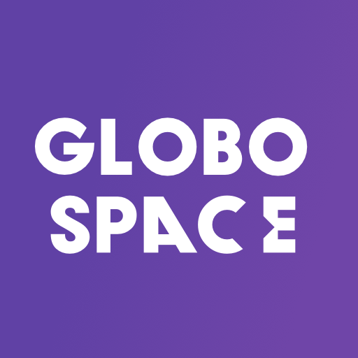
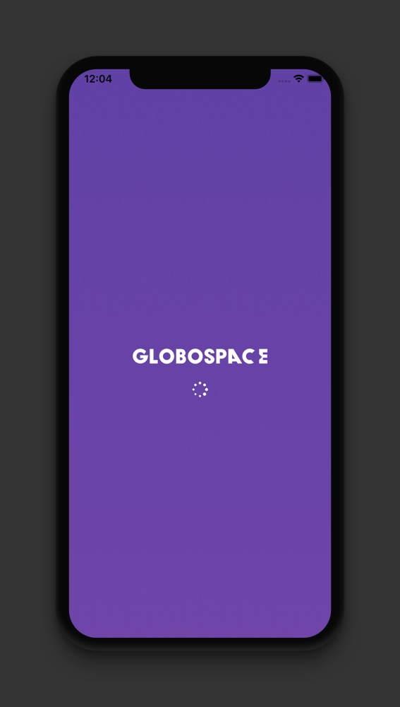
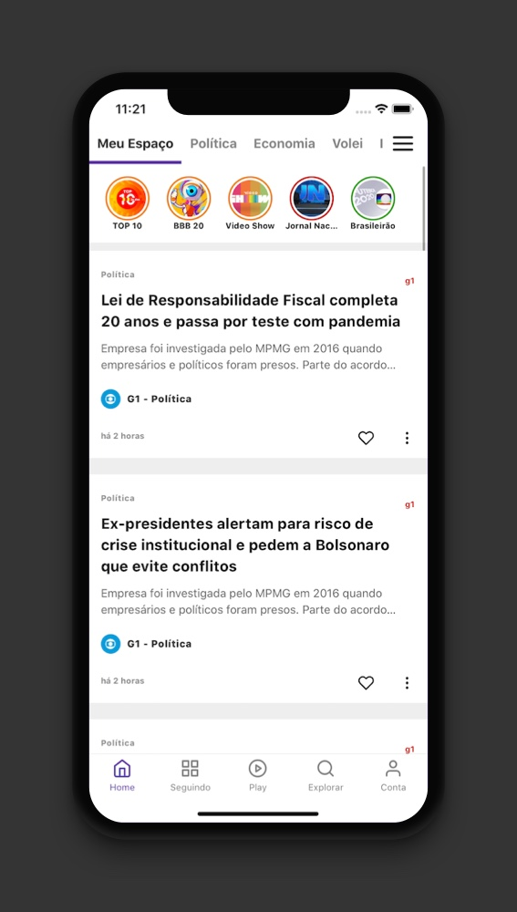
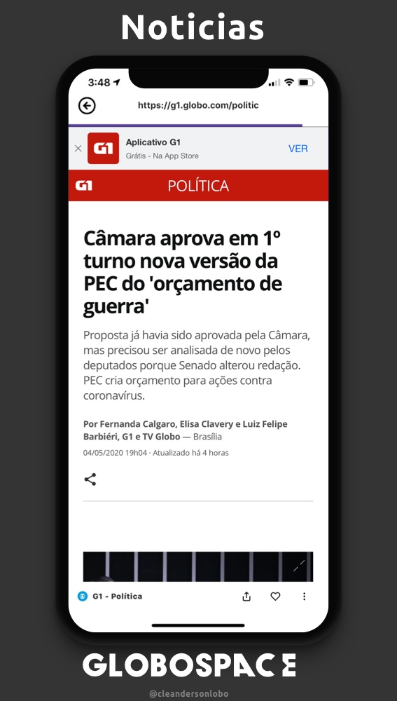
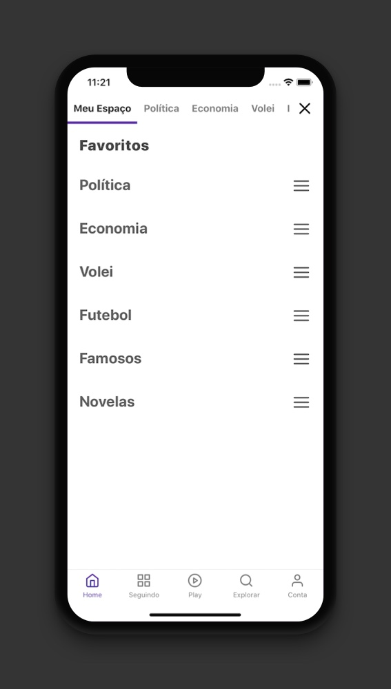
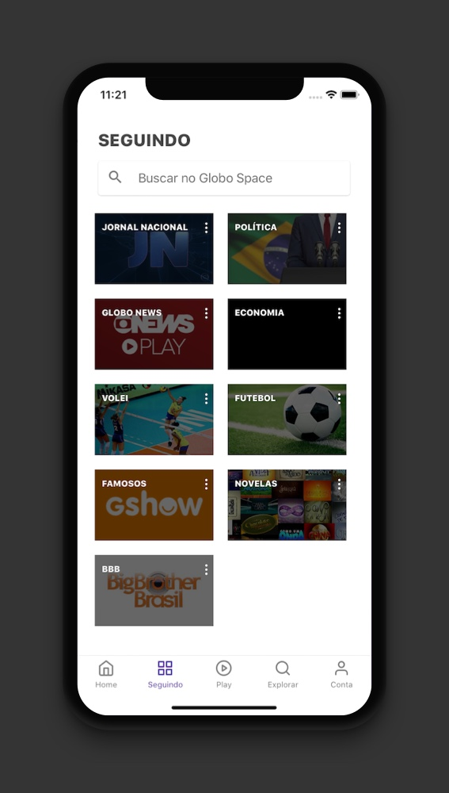

# megahack-globo-space

  
  <h2 align="center">
   <b>GloboSpace</b>
  </h2>
  

  

  A GloboSpace se trata de uma aplicação versátil e interativa que busca melhorar a experiência do usuário enquanto consome os produtos Globo.
  

  

##  **Splash**

##  **Meu Espaço**
### Espaço com conteudo que o usuário está seguindo

##  **WebView**

##  **Favoritos**

##  **Seguindo**

 

## Author

[Cleanderson Lobo](mailto:cleandersonlobo@gmail.com)

## RSS

[G1](http://g1.globo.com/tecnologia/noticia/2012/11/siga-o-g1-por-rss.html)

